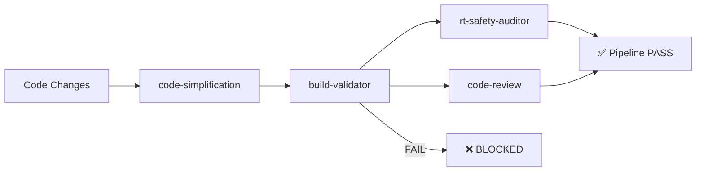

# Build Pipeline Documentation

## Overview

The build-validator pipeline ensures code quality by enforcing a **compile-before-assert** strategy across all validation agents. This prevents the "false confidence" problem where agents return ✅ PASS verdicts on uncompilable code.

## Pipeline Architecture



## Agent Pipeline Configuration

### Refactor Pipeline
```
code-simplification → build-validator → rt-safety-auditor → code-review
```

### Pre-Commit Pipeline  
```
build-validator → rt-safety-auditor
```

## Usage

### Quick Commands

**Cross-platform (via Claude Code agents):**
```bash
# Quick build validation
./tools/run-build-validator.sh

# With custom parameters
./tools/run-build-validator.sh build RelWithDebInfo SpectralCanvasPro
```

**Windows PowerShell:**
```powershell
# Direct PowerShell execution
.\tools\build-validator.ps1 -BuildDir build -Config RelWithDebInfo

# Via .bat wrapper
.\tools\run-build-validator.bat build RelWithDebInfo SpectralCanvasPro
```

### Pipeline Execution

**Full refactor pipeline:**
```bash
claude -p "Run refactor pipeline on recent changes"
```

**Pre-commit validation:**
```bash
claude -p "Run pre_commit pipeline"  
```

## Build Validation Features

### Enhanced Artifact Discovery
- **Platform-aware VST3 detection**: Windows (`**\*_artefacts\**\VST3\*.vst3`), POSIX (`**/*_artefacts/**/VST3/*.vst3`)  
- **Freshness validation**: Artifacts must be newer than build start time
- **Size validation**: Non-zero file size required
- **Fallback discovery**: Searches entire build tree if canonical paths not found

### Toolchain Metadata
- **Generator detection**: From CMakeCache.txt (Ninja, Visual Studio, Xcode, etc.)
- **Compiler identification**: Path and version extraction  
- **Build timing**: Precise duration measurement
- **Configuration tracking**: Debug, Release, RelWithDebInfo

### Pre-Lint Checks (Advisory)
- **JUCE API violations**: Detects `suspendProcessing(bool)` overrides on AudioProcessor
- **Missing methods**: Flags calls to non-existent `HopScheduler::reset()`
- **RT-safety patterns**: Common anti-patterns in audio code

### Greppable Output Format
```
STATUS: PASS/FAIL
CONFIG: RelWithDebInfo  
GENERATOR: Ninja
CXX: clang++ 16.0.6
DURATION: 92.4s
VST3: build/SpectralCanvasPro_artefacts/RelWithDebInfo/VST3/SpectralCanvasPro.vst3 (1.86 MB, fresh)
WARNINGS: 0  ERRORS: 0
```

## Failure Handling

### Compile Errors
When build-validator returns **FAIL**, downstream agents are **blocked**:
- rt-safety-auditor returns: `"Blocked by compile errors"` + Build_Summary.md  
- code-review returns: `"Blocked by compile errors"` + Build_Summary.md
- **No ✅ PASS verdicts** until compilation succeeds

### Common Failure Scenarios
1. **Syntax errors**: Missing semicolons, undefined symbols
2. **Linking failures**: Undefined references, library mismatches  
3. **Missing artifacts**: VST3 not generated or stale timestamps
4. **Warnings as errors**: When `strict_warnings=1` in CI
5. **Build timeouts**: Long compilation exceeds 30min limit

## Integration Examples

### Local Development Workflow
```bash
# 1. Make code changes
vim Source/SpectralCanvasProAudioProcessor.cpp

# 2. Quick build validation  
./tools/run-build-validator.sh

# 3. If PASS, run full pipeline
claude -p "Run refactor pipeline"

# 4. Commit when all agents pass
git commit -m "implement feature X"
```

### CI/CD Integration

**GitHub Actions example:**
```yaml
name: build-gate
on: [push, pull_request]
jobs:
  validate:
    runs-on: windows-latest
    steps:
      - uses: actions/checkout@v4
      - name: Build validation
        shell: pwsh
        run: |
          .\tools\build-validator.ps1 -StrictWarnings 1
      - name: Upload build summary
        uses: actions/upload-artifact@v4
        with:
          name: build-summary
          path: artifacts/build-validator/**/Build_Summary.md
```

## Troubleshooting

### Build Validator Fails
1. **Check Build_Summary.md**: Contains first error with context
2. **Review toolchain**: Verify CMake, compiler paths
3. **Clean build**: `rm -rf build && cmake -B build`  
4. **Check dependencies**: `git submodule update --recursive`

### False Positives
- **Stale artifacts**: Build_Summary.md shows timestamp details
- **Permission issues**: Check directory write permissions
- **Path problems**: Verify CMake can find JUCE modules

### Performance Issues  
- **Slow builds**: Check parallel job count (`-j` flag)
- **Timeout errors**: Increase `TimeoutSec` parameter
- **Large artifacts**: Monitor VST3 file sizes in summary

## Benefits

✅ **Eliminates false confidence** - No more ✅ PASS on uncompilable code  
✅ **RT-safety compliance** - Build errors caught before RT analysis  
✅ **Cross-platform coverage** - Windows PowerShell + POSIX shell scripts  
✅ **CI-ready integration** - Greppable output for automated parsing  
✅ **Zero disruption** - Existing agents unchanged, just preconditions added  
✅ **Actionable feedback** - Specific file:line errors with context

This implements the "Trust but Verify" strategy from `docs/agents-risk.md`, ensuring that RT audio development maintains the highest quality standards while preventing compilation failures from reaching production.